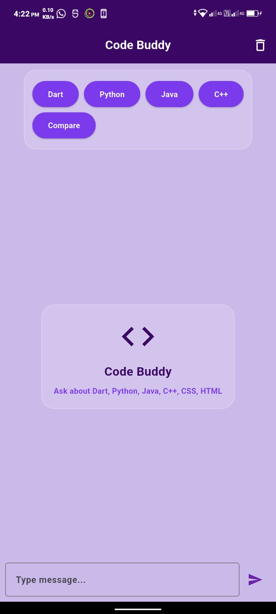
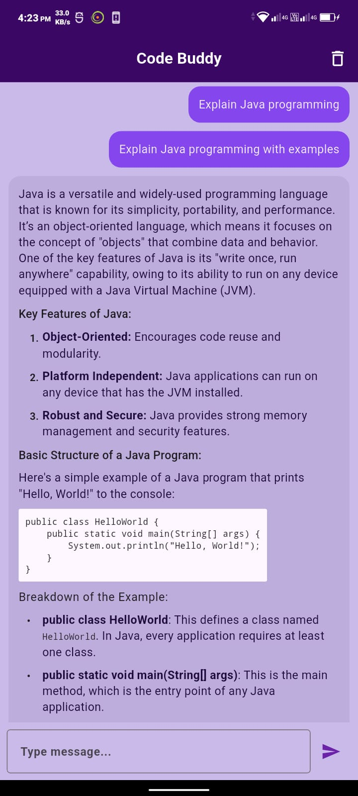

# 🤖 Code Buddy

A lightweight AI-powered programming assistant built with Flutter. Code Buddy helps developers learn and debug code using OpenRouter's GPT-4o-mini model, with offline message persistence via Hive.

---

## ✨ Features

### 💬 AI Chat
- **Smart Programming Assistant** — Ask questions about Dart, Python, Java, C++, HTML, CSS, and more
- **Context-Aware Conversations** — AI remembers chat history for natural, flowing dialogues
- **Code Examples** — Get practical code snippets with explanations
- **Beginner-Friendly** — Simple, encouraging responses for learners

### 🚀 Quick Start Modes
- **Language Selectors** — One-tap buttons for Dart, Python, Java, C++
- **Compare Mode** — Side-by-side language comparisons (e.g., Dart vs Python vs Java)
- **Instant Explanations** — Auto-generated programming overviews

### 💾 Offline Persistence
- **Hive Database** — All messages saved locally
- **Chat History** — Resume conversations anytime
- **Clear Chat** — Delete all messages with confirmation

### 🎨 UI/UX
- **Glassmorphism Design** — Frosted glass cards and smooth gradients
- **Markdown Support** — Rich text rendering for code blocks and formatting
- **Message Actions** — Long-press to copy or delete messages
- **Responsive Layout** — Works on mobile and tablet

---

## 🛠 Tech Stack

|     Layer       |        Technology        |
|-----------------|--------------------------|
| **Framework**   | Flutter 3.x              |
| **Language**    | Dart                     |
| **AI API**      | OpenRouter (GPT-4o-mini) |
| **Local DB**    | Hive                     |
| **HTTP Client** | `http` package           |
| **Markdown**    | `flutter_markdown`       |

---

 
  